GainVulkanSample
=============
This repo is to demonstrate some Vulkan usages on Android.
- Triangle and cube: Hello world in Graphics
- Texture: demonstrate bitmap rendering, YUV420 rendering with three samplers, YUV420 rendering with VkSamplerYcbcrConversion
- Camera preview: demonstrate how to render preview data from Camera API2
- Camera LUT: demonstrate how to render preview data with LUT filter from Camera API2
- Mutil LUT: demonstrate how to render preview data with mutilple LUT filters from Camera API2
- Histogram: demonstrate how to render histogram from preview data with Camera API2
- GLTF model: demonstrate how to render 3D model from glTF2.0 
- GLTF model with animal: demonstrate how to render 3D model with animation from glTF2.0
- GLTF model PBR: demonstrate how to render 3D model with PBR from glTF2.0

Pre-requisites
--------------
- Android Studio Chipmunk(Just suggest) 
- Android-ndk-r21
- CMake 3.10.2

Getting Started
---------------
1. Launch Android Studio
1. Select "Import project "
1. Browse into downloaded sample directory, select build.gradle in project's root directory
1. Click *Tools/Android/Sync Project with Gradle Files*.
1. Click *Run/Run 'app'*.

Screenshots
-----------
- Content

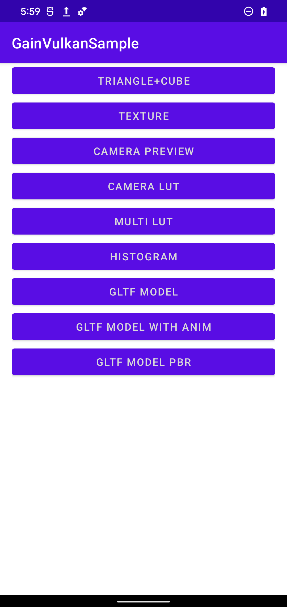

- Triangle: An easy triangle without any descriptor set even without mvp matrix 

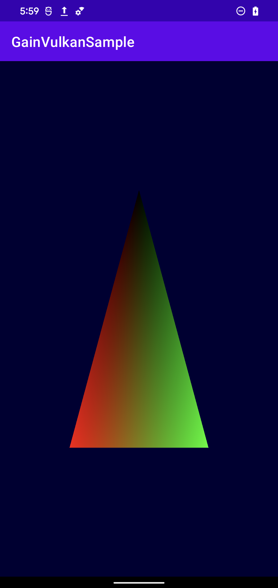

- Cube: Similar to triangle, but there is a mvp matrix uniform buffer in a descriptor set with a binding index

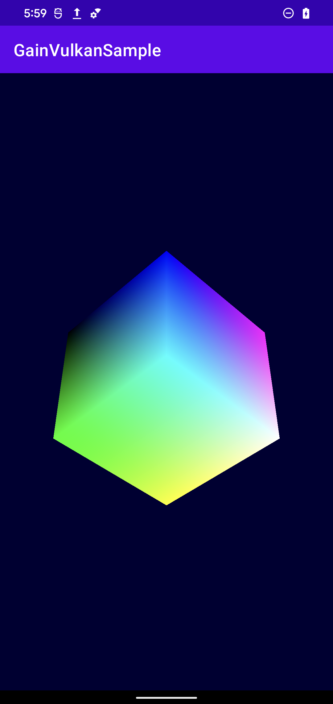

- Bitmap rendering: render bitmap, there is a mvp matrix uniform buffer in a descriptor set with a binding index and a combined image sampler in the same descriptor with another binding index

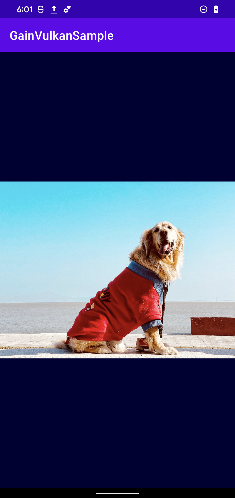

- YUV420 rendering: render YUV420, there is a mvp matrix uniform buffer in a descriptor set with a binding index and a array of combined image samplers with three sizes in the same descriptor with another binding index. Do YUV420 to RGBA convert in shader, it will downsample three times

- YUV420 rendering with VkSamplerYcbcrConversion: render YUV420 with VkSamplerYcbcrConversion, there is a mvp matrix uniform buffer in a descriptor set with a binding index and a combined image sampler in the same descriptor with another binding index. The YUV420 to RGBA convert will be done by VkSamplerYcbcrConversion and we just need one downsample

- Camera preview: render preview data from Camera API2. We preprocess the camera preview data into YUV420 format and render it the same way with YUV420 rendering

  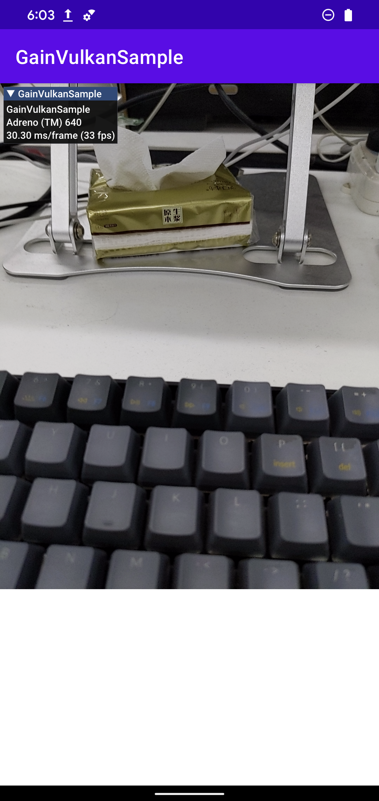

- Camera LUT:render preview data with LUT filter from Camera API2. We preprocess the camera preview data into YUV420 format. There is a mvp matrix uniform buffer in a descriptor set with a binding index and a array of combined image samplers with three sizes in the same descriptor with another binding index and another combined image sampler for LUT image in the same descriptor with another binding index. Do YUV420 to RGBA convert in shader, it will downsample three times

  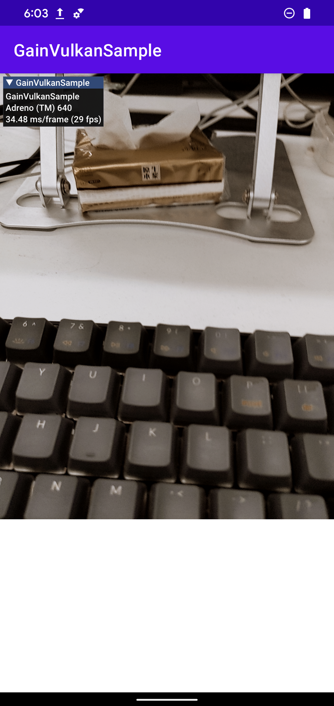

- Mutil LUT: single filter rendering is almost the same as Camera LUT. Difference are that we need push constants to set the position of filters and specialization constants to set the index of filter

  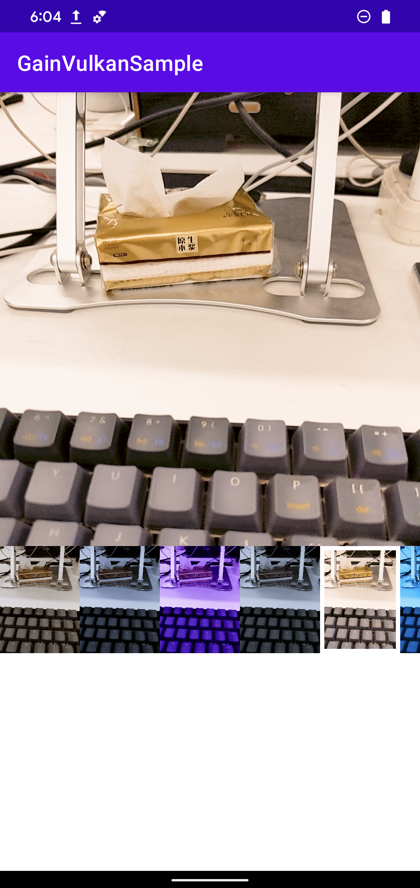

- Histogram: a compute pipeline compute the histogram and a graphic pipeline render it

  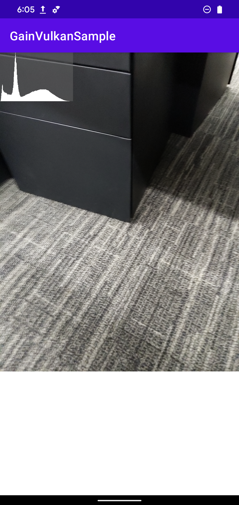

- GLTF model: render 3D model from glTF2.0. As the model is embedded, it will take some time for loading. BaseColor texture is chosen for material 

  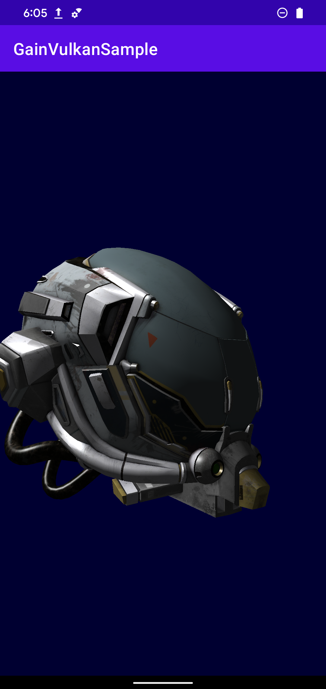
  
- GLTF model with animal: render 3D model with animation from glTF2.0. It shows how to handle joints for animation

  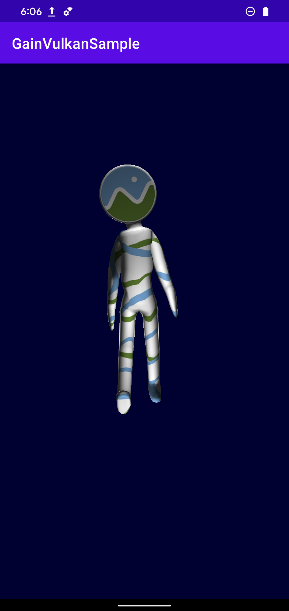
  
- GLTF model PBR: render 3D model with PBR from glTF2.0. It refers to Sascha Willems' PBR repo

  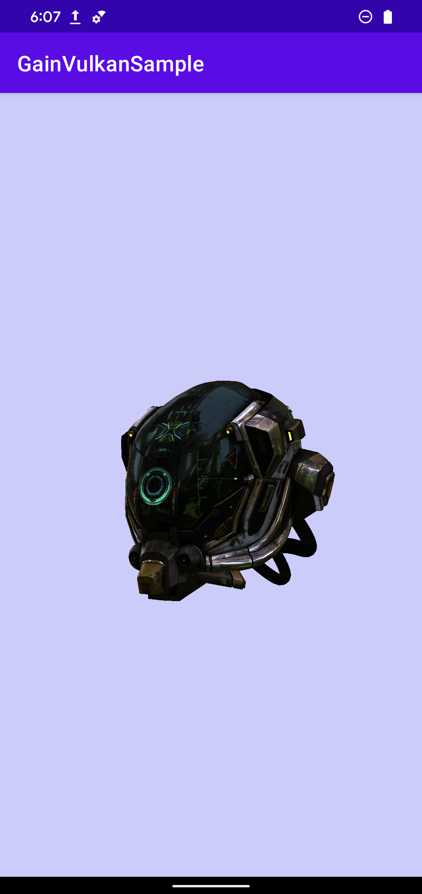
  
  
  

License
-------
The MIT License (MIT)

Copyright (c) 2022 Gain

Permission is hereby granted, free of charge, to any person obtaining a copy
of this software and associated documentation files (the "Software"), to deal
in the Software without restriction, including without limitation the rights
to use, copy, modify, merge, publish, distribute, sublicense, and/or sell
copies of the Software, and to permit persons to whom the Software is
furnished to do so, subject to the following conditions:

The above copyright notice and this permission notice shall be included in all
copies or substantial portions of the Software.

THE SOFTWARE IS PROVIDED "AS IS", WITHOUT WARRANTY OF ANY KIND, EXPRESS OR
IMPLIED, INCLUDING BUT NOT LIMITED TO THE WARRANTIES OF MERCHANTABILITY,
FITNESS FOR A PARTICULAR PURPOSE AND NONINFRINGEMENT. IN NO EVENT SHALL THE
AUTHORS OR COPYRIGHT HOLDERS BE LIABLE FOR ANY CLAIM, DAMAGES OR OTHER
LIABILITY, WHETHER IN AN ACTION OF CONTRACT, TORT OR OTHERWISE, ARISING FROM,
OUT OF OR IN CONNECTION WITH THE SOFTWARE OR THE USE OR OTHER DEALINGS IN THE
SOFTWARE.

